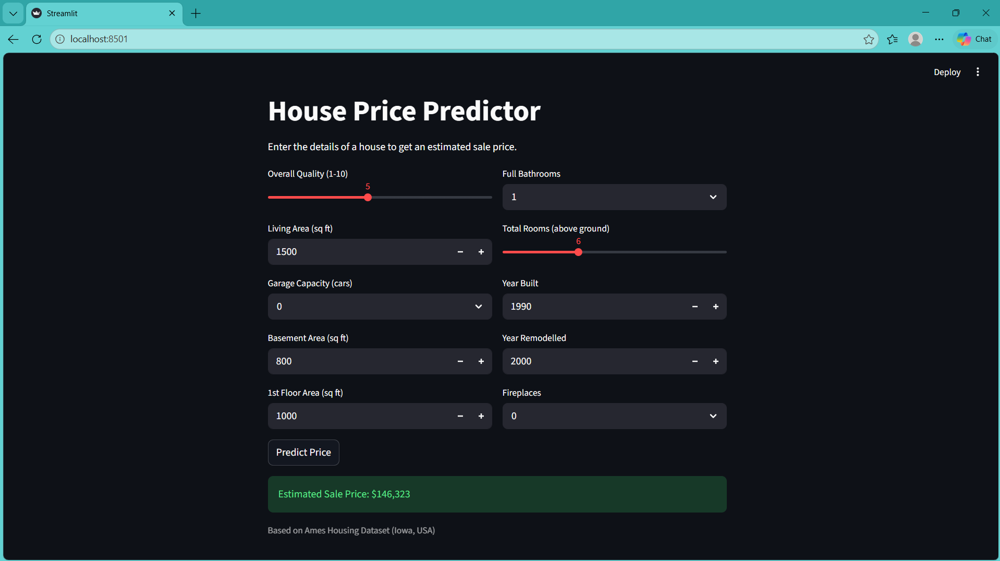
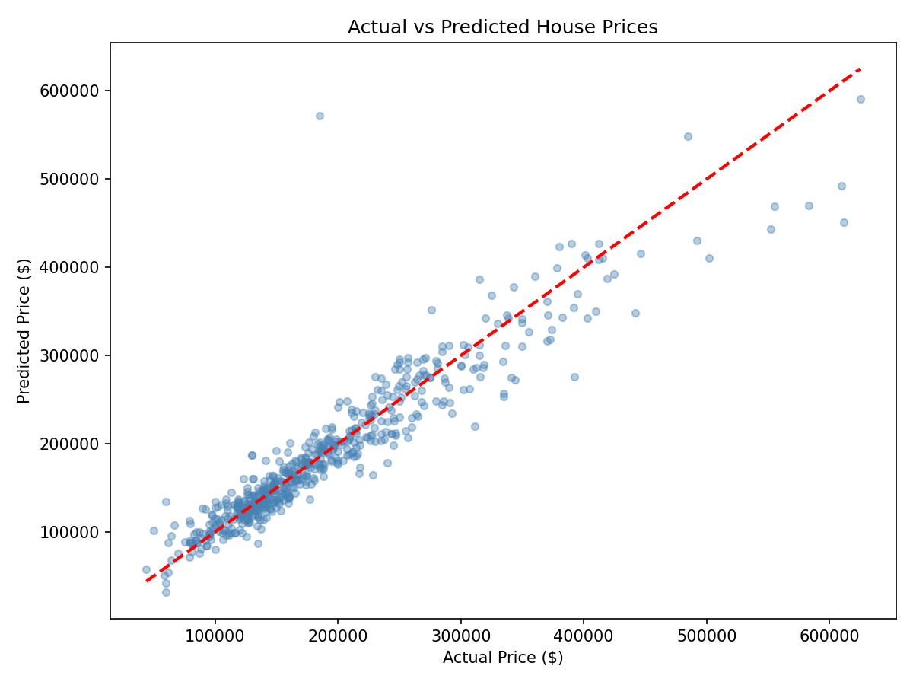
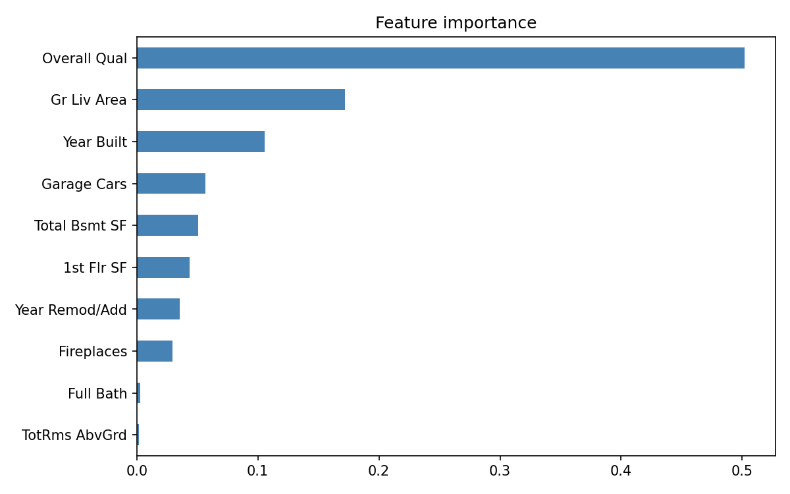

# 🏠 House Price Predictor

A machine learning web app that predicts house sale prices based on key property features — trained on 2,930 real homes from the Ames Housing Dataset with an **R² score of 0.8983** and **MAE of ~$17,955**.

Built with Python, scikit-learn, and Streamlit.

---

## 🚀 Live Demo

👉 **[Try the app here](https://sidharthmv9958-cpu-house-price-predictor-app-suka4e.streamlit.app/)**



---

## 📌 Project Overview

This project builds a complete regression ML pipeline from scratch:

- Loads and explores the Ames Housing Dataset (2,930 houses, 82 features)
- Performs **Exploratory Data Analysis (EDA)** — distributions, correlations, outliers
- Selects the 10 most impactful features based on correlation analysis
- Handles missing values and applies log-transformation to the target variable
- Trains and compares **3 ML algorithms** using cross-validation
- Selects the best model and evaluates it on unseen test data
- Deploys as an interactive **Streamlit web app** with live price predictions

---

## 📊 Results

| Metric | Score |
|---|---|
| R² Score | 0.8983 |
| Mean Absolute Error (MAE) | ~$17,995 |
| Root Mean Squared Error (RMSE) | ~$30,017 |
| Training samples | 2,344 |
| Test samples | 586 |

### Model Comparison

| Model | Cross-validated R² |
|---|---|
| Gradient Boosting | **0.8605** ← winner |
| Random Forest | 0.8474 |
| Linear Regression | 0.8199 |




---

## 🛠️ Tech Stack

| Tool | Purpose |
|---|---|
| Python 3.x | Core language |
| pandas | Data loading and manipulation |
| NumPy | Numerical operations, log-transform |
| scikit-learn | Model training, evaluation, pipelines |
| matplotlib / seaborn | EDA charts and visualisations |
| Streamlit | Interactive web app |
| joblib | Saving and loading the trained model |

---

## 📁 Project Structure

```
house-price-predictor/
│
├── train.py                  # Full ML pipeline: EDA, train, evaluate, save
├── app.py                    # Streamlit web app
├── model.pkl                 # Saved best model (Gradient Boosting pipeline)
├── features.pkl              # Saved feature list
├── price_distribution.png    # EDA: price distribution chart
├── correlations.png          # EDA: top correlated features
├── actual_vs_predicted.png   # Evaluation: actual vs predicted scatter plot
├── feature_importance.png    # Feature importance chart
├── requirements.txt          # All dependencies
└── README.md                 # This file
```

---

## ⚙️ How to Run Locally

**1. Clone the repository**
```bash
git clone https://github.com/sidharthmv9958-cpu/house-price-predictor.git
cd house-price-predictor
```

**2. Install dependencies**
```bash
pip install -r requirements.txt
```

**3. Download the dataset**

Download [AmesHousing.csv](https://www.kaggle.com/datasets/prevek18/ames-housing-dataset) from Kaggle and place it in the project folder.

**4. Train the model**
```bash
python train.py
```

**5. Run the web app**
```bash
streamlit run app.py
```

The app opens at `http://localhost:8501`

---

## 🧠 How It Works

```
Raw Housing Data (82 features)
        ↓
Exploratory Data Analysis (distributions, correlations)
        ↓
Feature Selection (top 10 by correlation with SalePrice)
        ↓
Missing Value Imputation + Log-transform target
        ↓
Train 3 Models → Cross-validate → Pick best (Gradient Boosting)
        ↓
Predict Price → Reverse log-transform → Display in $
```

---

## 🏡 Features Used for Prediction

| Feature | Description |
|---|---|
| Overall Qual | Overall material and finish quality (1–10) |
| Gr Liv Area | Above-ground living area (sq ft) |
| Garage Cars | Garage capacity (number of cars) |
| Total Bsmt SF | Total basement area (sq ft) |
| 1st Flr SF | First floor area (sq ft) |
| Full Bath | Number of full bathrooms |
| TotRms AbvGrd | Total rooms above ground |
| Year Built | Original construction year |
| Year Remod/Add | Year of last remodel |
| Fireplaces | Number of fireplaces |

---

## 📈 Key Visualisations

**Price Distribution** — shows the raw skewed distribution and the log-transformed version used for training

**Correlation Analysis** — identifies which features have the strongest relationship with sale price

**Actual vs Predicted** — scatter plot showing model accuracy on the test set; points near the diagonal = accurate predictions

**Feature Importance** — shows which features the Gradient Boosting model relied on most

---

## 📦 Requirements

```
pandas
numpy
scikit-learn
matplotlib
seaborn
streamlit
joblib
```

---

## 🔮 Future Improvements

- [ ] Add more features (neighbourhood, house style, roof type)
- [ ] Try XGBoost or LightGBM for higher accuracy
- [ ] Add SHAP values to explain individual predictions
- [ ] Train on a larger, more recent housing dataset
- [ ] Add a price range confidence interval to the prediction

---

## 👤 Author

**Your Name** — [GitHub](https://github.com/sidharthmv9958-cpu) · [LinkedIn](https://linkedin.com/in/sidharthmv9958)

---

## 📄 License

This project is open source under the [MIT License](LICENSE).
